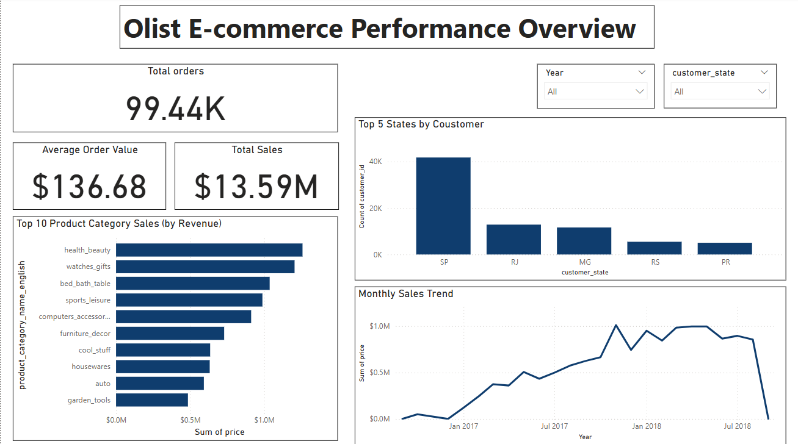
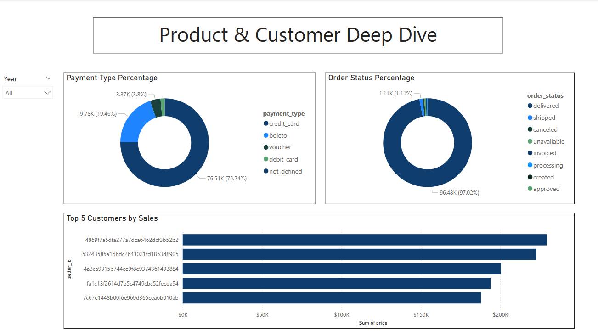

\# Olist E-commerce Data Analysis and Dashboard

\## Project Overview

This project analyzes the Olist Brazilian E-commerce Public Dataset to provide key insights into sales performance, customer behavior, and operational efficiency, aiming to support data-driven decision-making. The analysis spans from initial SQL data exploration and querying to building an interactive and professional dashboard in Power BI.

\## Tools Used

\* \*\*SQL:\*\* For data extraction, cleaning, and initial analytical querying.

\* \*\*Power BI Desktop:\*\* For data modeling, DAX measure creation, and interactive dashboard visualization.

\## Dashboard Highlights

The interactive dashboard provides key insights across two main pages:

\### 1. Performance Overview

\* \*\*Key Performance Indicators (KPIs):\*\* Displays total orders, average order value, and total sales.

\* \*\*Monthly Sales Trend:\*\* Visualizes sales performance over time to identify growth patterns and seasonality.

\* \*\*Top 5 States by Customer:\*\* Highlights the geographical distribution of customers, focusing on the top contributing states.

\* \*\*Top 10 Product Category Sales (by Revenue):\*\* Identifies the highest-revenue-generating product categories.

\### 2. Product \& Customer Deep Dive

\* \*\*Payment Type Percentage:\*\* Shows the distribution of various payment methods used by customers.

\* \*\*Order Status Percentage:\*\* Provides an overview of the status of orders (e.g., delivered, pending, canceled).

\* \*\*Top 5 Customers by Sales:\*\* Showcases customers with the highest total sales contributions.

\## Interactivity

The dashboard features synced dropdown slicers for 'Year' and 'Customer State', allowing users to dynamically filter all visuals across both pages for detailed exploration.

\## Project Structure

## How to View the Dashboard

You can view the dashboard by:
1.  Downloading the `Olist_E-commerce_Dashboard.pbix` file and opening it with Power BI Desktop for an interactive experience.
2.  Viewing the static `Olist_E-commerce_Dashboard.pdf` file, which contains all dashboard pages.

## Screenshots

